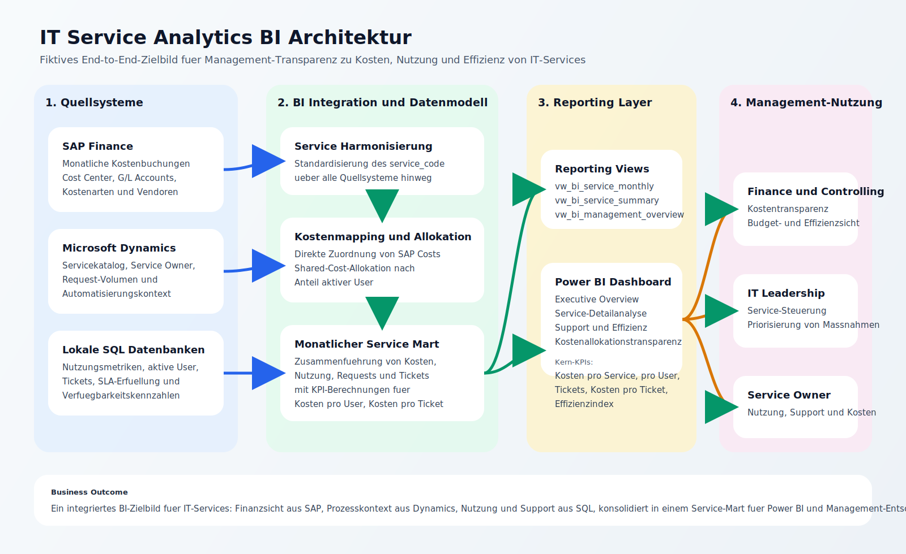

# Architekturuebersicht

Das folgende Diagramm zeigt die Zielarchitektur fuer das BI-Showcase von den Quellsystemen bis zum Management-Reporting.

## Kernaussagen

- SAP liefert die finanzielle Sicht auf Servicekosten.
- Microsoft Dynamics liefert Servicekatalog- und Prozesskontext.
- Lokale SQL-Datenbanken liefern Nutzungs- und Supportmetriken.
- Die BI-Schicht harmonisiert Service-Codes, mappt Kosten und allokiert Shared Costs.
- Ein monatlicher Service Mart versorgt Reporting Views und Power BI.
- Das Management erhaelt Transparenz zu Kosten, Nutzung und Effizienz.
